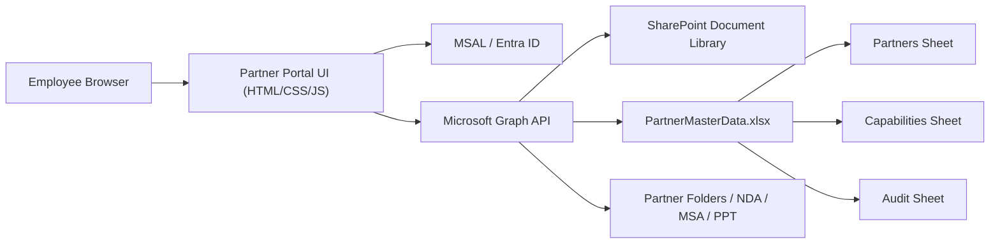

# SDLC Report

## 1. Planning

- Objective: deliver a secure internal partner management portal backed by SharePoint Online and a master Excel workbook.
- Stakeholders: business development, partner operations, internal IT, security, and audit/compliance teams.
- Scope: dashboard analytics, partner CRUD, search/filtering, capability statement capture, SharePoint folder synchronization, CSV export, Entra sign-in hooks, audit traceability, and deployment/maintenance SOPs.
- Non-functional goals: responsive enterprise UI, controlled workbook updates, no client-side storage, least-privilege Graph access, and recoverable operational workflows.

### Requirements Baseline

- Single source of truth: `PartnerMasterData.xlsx`.
- SharePoint partner folder per company.
- Capability statement structured for Excel and PowerPoint automation.
- Internal-only authentication with Microsoft Entra ID.
- Audit sheet for every add/edit/delete/export event.

### Data Model Summary

- `Partners` sheet: core partner metadata plus serialized capability JSON.
- `Capabilities` sheet: normalized capability payload by company.
- `Audit` sheet: timestamp, actor, action, detail string.

### Wireframe Summary

- Left navigation with Dashboard, Add Partner, Database, Analytics, and Security views.
- KPI cards plus status summary and audit timeline on landing screen.
- Form-first partner entry experience with structured capability section.
- Searchable database grid with view/edit/delete actions.

## 2. Design

### Architecture

### UI Design Decisions

- Light professional theme with Poppins, deep navy sidebar, ice-toned workspace, rounded cards, and compact data controls.
- TailwindCSS for layout speed and consistency, with a small custom stylesheet for brand-specific treatment.
- Explicit action buttons and modal drill-down to preserve familiarity with HubSpot/Salesforce patterns.

### SharePoint Schema

- Library root contains `PartnerMasterData.xlsx` and `/Partners`.
- `/Partners/<Company>/` stores partner documents plus generated capability presentation.
- Excel tables recommended:
  - `TablePartners`
  - `TableCapabilities`
  - `TableAudit`

## 3. Implementation

### Delivered Components

- `index.html`: responsive shell, navigation, forms, tables, modal layout, footer.
- `style.css`: enterprise UI treatment and utility classes.
- `app.js`: state management, demo-mode repository, Graph repository hooks, auth flow hooks, filters, analytics, exports.
- `lib/core.js`: sanitization, validation, migration, analytics, CSV generation.
- `tests/core.test.js`: Node-based validation suite for critical data logic.
- `scripts/setup-sharepoint.ps1`: SharePoint bootstrap checklist.
- `scripts/generate-capability-ppt.ts`: Office Script starter for workbook-driven PPT data preparation.

### Backward Compatibility

- Legacy workbook-shaped records are mapped through `migrateLegacyPartner`.
- Capability JSON is parsed into the new structured model with fallback handling.
- Missing historical fields default safely rather than breaking rendering.

## 4. Testing

- Unit focus: sanitization, validation, migration, filtering, analytics, CSV export.
- Integration-ready areas: Graph workbook reads/writes, folder creation, Entra sign-in.
- Manual UX checks recommended after SharePoint wiring:
  - Sign-in gate
  - Add partner
  - Edit partner
  - Delete partner
  - CSV export
  - Audit row creation
  - Folder creation

## 5. Deployment

- Host as SharePoint Online embedded page or GitHub Pages for static delivery.
- Production mode requires Entra application registration and Graph delegated permissions.
- Workbook tables and partner library must exist before enabling writes.

## 6. Maintenance

- Weekly workbook backup export.
- Monthly access review for site members and app registration permissions.
- Audit sheet review for anomalous activity.
- Regression test run before each release.

## 7. Quality Status

- Local code artifacts and tests are included.
- Final production sign-off still requires tenant-specific integration validation, penetration testing, and UAT in the target Microsoft 365 environment.
